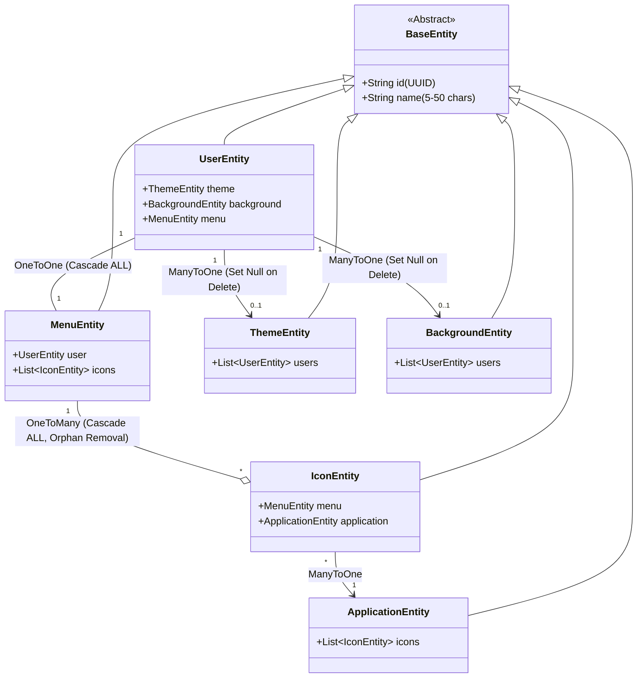

# Családi App Kezelő Rendszer (Family App Management System)

[](https://opensource.org/licenses/MIT)
[](https://www.oracle.com/java/technologies/javase/jdk17-archive-downloads.html)
[](https://spring.io/projects/spring-boot)
[](https://www.jacoco.org/jacoco/)

Egy modern, robusztus és biztonságos Spring Boot alapú háttérrendszer (backend) családi alkalmazások kezelésére és
testreszabására. A projekt lehetővé teszi a családtagok felhasználói profiljainak kezelését, egyedi menüstruktúrák és
ikonok hozzárendelését, valamint a felület vizuális elemeinek (témák, háttérképek) személyre szabását.

---

## Tartalomjegyzék

1. [Főbb funkciók](#-főbb-funkciók)
2. [Alkalmazott technológiák](#-alkalmazott-technológiák)
3. [Rendszerarchitektúra és adatmodell](#-rendszerarchitektúra-és-adatmodell)
4. [Telepítés és helyi futtatás](#-telepítés-és-helyi-futtatás)
5. [REST API Végpontok (API Reference)](#-rest-api-végpontok-api-reference)
6. [Biztonság és jogosultságok](#-biztonság-és-jogosultságok)
7. [Automatizált tesztelés és kódlefedettség](#-automatizált-tesztelés-és-kódlefedettség)
8. [Hozzájárulás és fejlesztés](#-hozzájárulás-és-fejlesztés)
9. [Licenc](#-licenc)

---

## Főbb funkciók

- **Személyre szabható felhasználói profilok (User Profiles):** Családtagok kezelése egyedi témával, háttérképpel és
  saját menürendszerrel.
- **Dinamikus menük és ikonok (Dynamic Menus & Icons):** Minden felhasználó rendelkezik egy saját menüvel, amely a
  hozzárendelt alkalmazások ikonjait tartalmazza.
- **Alkalmazás-katalógus (Application Catalog):** A családi rendszerben elérhető modulok/alkalmazások központi
  nyilvántartása.
- **Témák és háttérképek kezelése (Themes & Backgrounds):** A felület dizájnját meghatározó stílus- és látványelemek
  CRUD kezelése.
- **Referenciális integritás és törlési szabályok:** Automatizált adatbázis-szintű cascade törlések és `SET NULL`
  szabályok a biztonságos adatkezelés érdekében (pl. téma törlésekor a felhasználó témája nullázódik ahelyett, hogy a
  profil törlődne).
- **Robusztus DTO & Entity szétválasztás:** Nagyteljesítményű típusbiztos leképzések MapStruct és Lombok segítségével.

---

## Alkalmazott technológiák

### Backend Core

- **Java 17** (LTS verzió)
- **Spring Boot 4.0.6**
    - **Spring Web** (RESTful API-k fejlesztése)
    - **Spring Data JPA** (Adatbázis elérés és ORM)
    - **Spring Security** (Biztonsági réteg és CORS konfiguráció)
    - **Spring Validation** (Bemenő adatok `@Valid` validációja)

### Adatbázis

- **PostgreSQL** (Termelési környezetre kész relációs adatbázis)
- **Hibernate / JPA** (Entity mapping és ddl-auto sémakezelés)

### Kiegészítő könyvtárak és eszközök

- **Lombok:** Boilerplate kódok (Getter, Setter, Builder) automatikus generálása.
- **MapStruct 1.5.5.Final:** Gyors és memóriahatékony DTO-Entity konverzió (reflexiómentes kódgenerálás útján).
- **Maven:** Projektmenedzsment és függőségkezelés.
- **JaCoCo 0.8.12:** Kódlefedettség-mérő és riportgeneráló eszköz az egységtesztek minőségbiztosításához.

---

## Rendszerarchitektúra és adatmodell

A projekt a tiszta, többrétegű architektúra (Layered Architecture) mintát követi:

1. **Controller réteg:** Fogadja a HTTP kéréseket, elvégzi a bemeneti adatok validációját és REST válaszokat ad vissza.
2. **Service réteg:** Tartalmazza a szigorú üzleti logikát és a tranzakció-kezelést (`@Transactional`).
3. **Repository réteg:** Biztosítja az absztrakciót az adatbázis műveletek felett (Spring Data `JpaRepository`).
4. **DTO-k (Data Transfer Objects):** Csak a szükséges adatmezőket továbbítják a kliens és a szerver között, elrejtve a
   belső entitások struktúráját és megakadályozva a nemkívánatos adatkiáramlást.

### Adatbázis séma (Domain Modell)

Minden entitás a közös `BaseEntity`-ből örököl, amely automatikus UUID azonosítót (`id`) és egy validált `@NotBlank`
`name` mezőt biztosít.



---

## Telepítés és helyi futtatás

### Előfeltételek

- **Java Development Kit (JDK) 17** vagy újabb
- **Apache Maven 3.8+** (vagy használható a beépített `mvnw` wrapper)
- **PostgreSQL 14+** (helyi vagy felhős adatbázis példány)

### Lépések

1. **Klónozd a tárolót:**
   ```bash
   git clone https://github.com/your-username/csaladi_app_kezelo_rendszer.git
   cd csaladi_app_kezelo_rendszer
   ```

2. **Adatbázis létrehozása:**
   Indíts el egy PostgreSQL szervert, és hozz létre egy üres adatbázist a konfiguráció szerint:
   ```sql
   CREATE DATABASE csaladi_app_kezelo_rendszer;
   ```

3. **Alkalmazás konfigurálása:**
   Nyisd meg a `src/main/resources/application.yaml` fájlt, és szükség esetén módosítsd az adatbázis elérési útvonalát
   és a hozzáférési adatokat:
   ```yaml
   spring:
     datasource:
       url: jdbc:postgresql://localhost:5432/csaladi_app_kezelo_rendszer
       username: postgres
       password: postgres
   ```

4. **Projekt fordítása és tesztek futtatása:**
   Fordítsd le a projektet a MapStruct osztályok legenerálásához, és futtasd az egységteszteket:
   ```bash
   ./mvnw clean package
   ```
   *(Windows környezetben használd a `mvnw.cmd clean package` parancsot)*

5. **Indítás:**
   Futtasd a Spring Boot alkalmazást:
   ```bash
   ./mvnw spring-boot:run
   ```
   Az alkalmazás alapértelmezetten a `http://localhost:8080` porton lesz elérhető.

---

## REST API Végpontok (API Reference)

A rendszer minden végpontja a `/manager` prefix alatt található. Az API válaszok formátuma egységesen
`application/json`. Minden entitás rendelkezik teljes CRUD (Create, Read, Update, Delete) támogatással.

### Felhasználók (`/manager/user`)

- `GET /manager/user` - Összes felhasználó listázása
- `GET /manager/user/{id}` - Felhasználó lekérése egyedi azonosító alapján
- `POST /manager/user` - Új felhasználói profil létrehozása (Validált DTO body szükséges)
- `PUT /manager/user/{id}` - Meglévő felhasználó frissítése (Lombok-MapStruct részleges módosítási logikával)
- `DELETE /manager/user/{id}` - Felhasználó törlése (cascade-eli a saját menüjét, de megtartja a kapcsolódó
  témát/hátteret)

### Alkalmazások (`/manager/application`)

- `GET /manager/application` - Elérhető appok listázása
- `GET /manager/application/{id}` - Alkalmazás részletei
- `POST /manager/application` - Új alkalmazás regisztrálása a katalógusba
- `PUT /manager/application/{id}` - Alkalmazás adatainak módosítása
- `DELETE /manager/application/{id}` - Alkalmazás eltávolítása a katalógusból

### További erőforrások végpontjai

Hasonló CRUD végpontok érhetőek el az alábbi útvonalakon az adminisztrációs és beállítási feladatokhoz:

- **Témák:** `/manager/theme`
- **Hátterek:** `/manager/background`
- **Menük:** `/manager/menu`
- **Ikonok:** `/manager/icon`

---

## Biztonság és jogosultságok

A projekt a **Spring Security**-t használja az API-k védelmére.

- A **CORS** konfiguráció alapértelmezetten engedélyezi a kéréseket minden forrásból (`@CrossOrigin("*")`), így
  megkönnyíti az integrációt a frontend (pl. Angular, React, Vue) alkalmazásokkal.
- A CSRF (Cross-Site Request Forgery) védelem ki van kapcsolva a RESTful és stateless működés érdekében.
- A `/manager/**` alatti erőforrások jelenleg nyilvánosan hozzáférhetőek (`permitAll()`), míg minden egyéb végpont
  autentikációt igényel. Ez a struktúra kiváló alapot biztosít a későbbi szerepkör-alapú (RBAC) engedélyezési rendszerek
  bevezetéséhez.

---

## Automatizált tesztelés és kódlefedettség

A projekt nagy hangsúlyt fektet a megbízhatóságra és a tesztlefedettségre. Az egységtesztek (Unit Tests) lefedik a
kritikus adatleképezési folyamatokat, az üzleti logikát és a kontroller végpontokat.

### Tesztek futtatása

Futtasd az összes tesztet a következő paranccsal:

```bash
./mvnw test
```

### Kódlefedettség ellenőrzése (JaCoCo)

A projektbe be van építve a `jacoco-maven-plugin`. A tesztek lefutása után a JaCoCo automatikusan legenerál egy
látványos HTML alapú lefedettségi riportot.

1. Futtasd a teszteket:
   ```bash
   ./mvnw clean test
   ```
2. Nyisd meg a generált riportot a böngésződben:
    - **Elérési út:** `target/site/jacoco/index.html`

A riport megmutatja az osztályok, metódusok és ágak (branches) lefedettségét százalékos és darabszámos bontásban is.

---

## Hozzájárulás és fejlesztés

Ha szeretnél hozzájárulni a projekthez:

1. Készíts egy másolatot (Fork) a projektből.
2. Hozz létre egy új ágat a funkciónak (`git checkout -b feature/amazing-feature`).
3. Commitold a változtatásaidat (`git commit -m 'Add some amazing feature'`).
4. Pushold az ágat (`git push origin feature/amazing-feature`).
5. Nyiss egy Pull Request-et.

*Megjegyzés: Kérjük, győződj meg róla, hogy minden új funkcióhoz írtál megfelelő egységtesztet, és az összes meglévő
teszt sikeresen lefut!*

---

## Licenc

Ez a projekt az **MIT Licenc** alatt érhető el. További információkért olvasd el a `LICENSE` fájlt.
